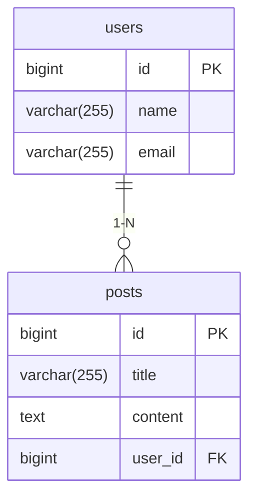

# Spring Boot API: Gerenciamento de Usuários e Posts

API RESTful desenvolvida com Spring Boot para gerenciar usuários e posts, com suporte a H2 (dev) e PostgreSQL (prod). Inclui Swagger, tratamento de exceções, CORS e boas práticas de desenvolvimento.

## 📋 Tabela de Conteúdos
- [Funcionalidades](#✨-funcionalidades)
- [Tecnologias](#🚀-tecnologias)
- [Modelo de Dados](#📊-modelo-de-dados)
- [Rotas da API](#🔧-rotas-da-api)
- [Swagger](#📖-swagger)
- [Execução Local](#🛠️-execução-local)
- [Deploy no Railway](#☁️-deploy-no-railway)
- [Boas Práticas](#🎯-boas-práticas)
- [Contribuição](#🤝-contribuição)

## ✨ Funcionalidades
- CRUD de Usuários
- CRUD de Posts (relacionados a usuários)
- Validação de DTOs
- Tratamento global de exceções
- Swagger para documentação interativa
- Configuração de CORS
- Perfis de `dev` (H2) e `prd` (PostgreSQL)

## 🚀 Tecnologias
- **Java 17**
- **Spring Boot 3.4.3**
- Spring Data JPA
- H2 (Desenvolvimento)
- PostgreSQL (Produção)
- Lombok
- ModelMapper
- Springdoc OpenAPI (Swagger)
- Railway (Deploy)

## 📊 Modelo de Dados

# 🔧 Rotas da API

## 🧑 Usuários (`/api/users`)

| Método  | Rota     | Descrição              | Exemplo de Body (JSON)                          |
|---------|----------|-----------------------|------------------------------------------------|
| `POST`  | `/`      | Cria um usuário        | `{ "name": "John", "email": "john@email.com" }` |
| `GET`   | `/`      | Lista todos os usuários| `-`                                            |
| `GET`   | `/{id}`  | Busca usuário por ID   | `-`                                            |
| `PUT`   | `/{id}`  | Atualiza usuário      | `{ "name": "John Updated", "email": "updated@email.com" }` |
| `DELETE`| `/{id}`  | Deleta usuário        | `-`                                            |

---

## 📝 Posts (`/api/posts`)

| Método  | Rota              | Descrição              | Exemplo de Body (JSON)                          |
|---------|-------------------|-----------------------|------------------------------------------------|
| `POST`  | `/`                | Cria um post          | `{ "title": "My Post", "content": "Lorem ipsum", "userId": 1 }` |
| `GET`   | `/user/{userId}`   | Lista posts por usuário| `-`                                           |
| `GET`   | `/{id}`            | Busca post por ID     | `-`                                           |
| `PUT`   | `/{id}`            | Atualiza post         | `{ "title": "Updated Title", "content": "Updated content" }` |
| `DELETE`| `/{id}`            | Deleta post          | `-`                                           |

---

## 📖 Swagger

Acesse a documentação interativa em:  
[http://localhost:8080/swagger-ui.html](http://localhost:8080/swagger-ui.html)
